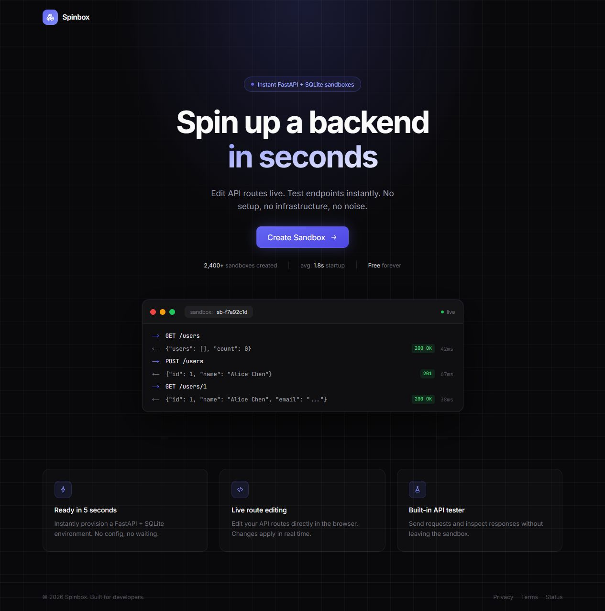
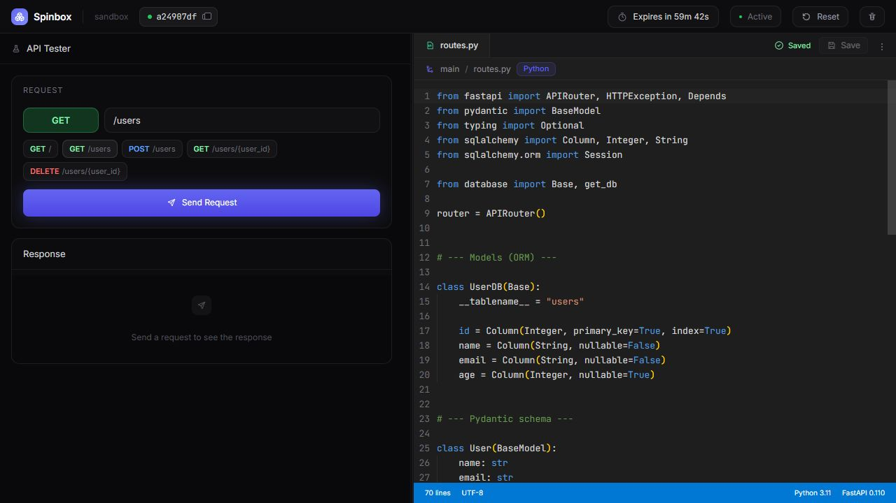

# Spinbox

Spinbox is a browser-based API sandbox for quickly prototyping backend ideas.

Create a sandbox in seconds, edit FastAPI routes live, and test endpoints from the same interface without setting up a local project, wiring a database, or bouncing between tools. The product is designed to make backend experimentation feel immediate.

## Screenshots





## What It Feels Like

Spinbox is built around a simple loop:

1. Create a sandbox.
2. Edit `routes.py` in the browser.
3. Send requests instantly.
4. Reset, iterate, or start over.

The goal is not to reproduce a full cloud environment. The goal is to remove friction from the first few minutes of backend work, where speed and clarity matter most.

## Core Experience

- Instant sandbox creation with a ready-to-edit FastAPI-style backend
- Live route editing in the browser
- Built-in API testing for quick request and response feedback
- Reset and delete flows for fast iteration
- Temporary sandbox lifecycle management with automatic expiration
- Shared control plane that keeps the product responsive while staying lightweight

## Who It Is For

Spinbox is useful anywhere a backend needs to be sketched, demonstrated, or explored quickly:

- Product demos and interactive prototypes
- Early API design and endpoint exploration
- Internal tooling experiments
- Developer onboarding and teaching environments
- Fast validation before investing in a full service

## Product Principles

- Fast to start: the first useful request should happen almost immediately
- Focused by default: editing and testing happen in one place
- Disposable on purpose: sandboxes are temporary and easy to reset
- Lightweight infrastructure: the system is optimized for rapid iteration, not long-lived workloads

## Stack

Spinbox currently consists of:

- `frontend/` - Next.js App Router application with React and TypeScript
- `backend/` - FastAPI control plane for sandbox creation, editing, proxying, and cleanup
- Firestore-backed sandbox lifecycle metadata
- Cloud Run-compatible deployment for the product surface and sandbox management services

## Local Development

### Backend

The backend loads `backend/.env` automatically on startup. Keep local-only values there and supply production configuration through your deployment environment.

```bash
cd backend
python -m venv .venv
.venv\Scripts\activate
pip install -r requirements.txt
uvicorn app.main:app --reload
```

The backend runs on `http://localhost:8000`.

### Frontend

```bash
cd frontend
npm install
npm run dev
```

The frontend runs on `http://localhost:3000`.

If the backend is not running at `http://localhost:8000`, set `NEXT_PUBLIC_API_BASE_URL` before starting the frontend.

### From The Repo Root

If you want the convenience entry point, the root script starts the frontend:

```bash
npm install
npm run dev
```

## Deployment Notes

Spinbox is currently structured as separate frontend and backend services, with sandbox lifecycle state persisted outside the runtime so cleanup and orchestration continue to work reliably.

The deployment scripts in `scripts/` are examples for a Cloud Run-compatible setup. They do not include project-specific configuration, credentials, hosted endpoints, or service-account values. To deploy your own copy, provide your own project id, service accounts, image names, and runtime secrets.

## Status

Spinbox is now an open source snapshot of the product experience shown above. The original hosted demo is not intended to remain online, so the screenshots are the durable reference for how the app looked and worked.

The public repository has been flattened to a single clean release commit and does not retain the earlier private deployment history. Local `.env` files are ignored; keep any credentials, account identifiers, and production URLs outside version control.
